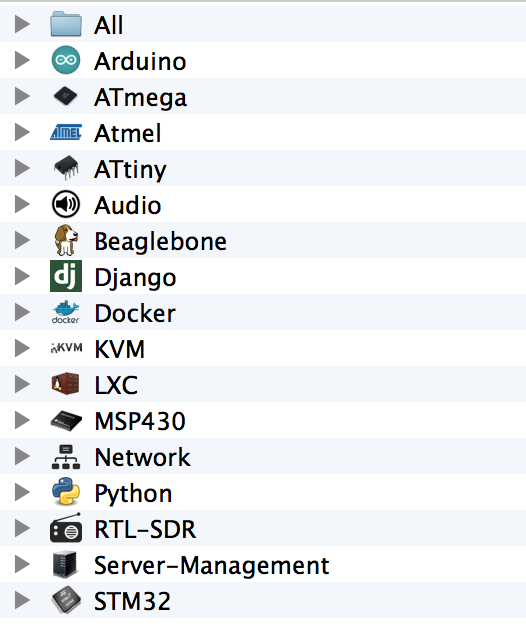

## Intended usage

Throw all your projects in the $TARGET/All directory (by default: /Users/lukas2511/Projects, if you are not me you may want to change that.)

Now use OSX Finder or the [tag command line tool](https://github.com/jdberry/tag) to set tag names on the projects.

As soon as you execute "build.py" it will create $TARGET/$TAG directories, and symlink all tagged projects in those folders.

If you create a folder $TARGET/All/.icons, and place .png files with the tag name in there the script will set this icon for the tag folder.

Example:

)
